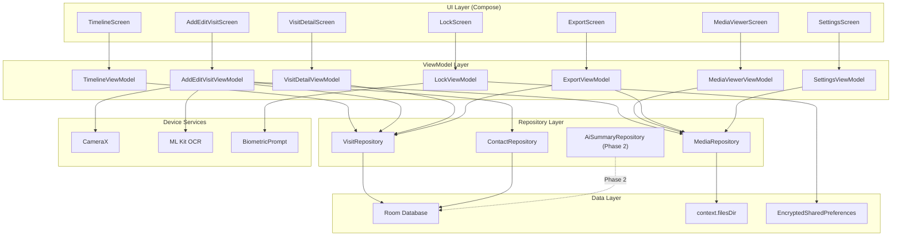
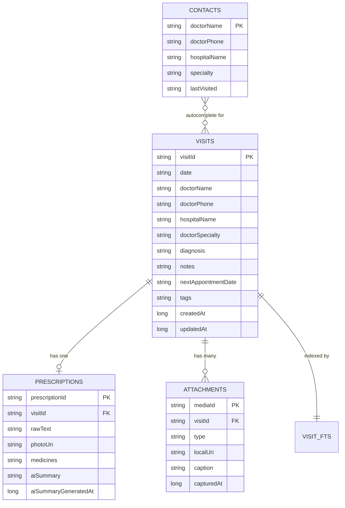
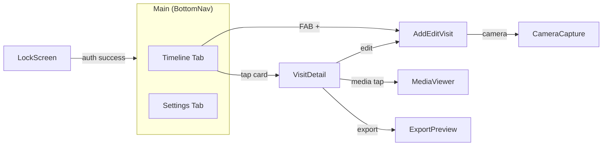
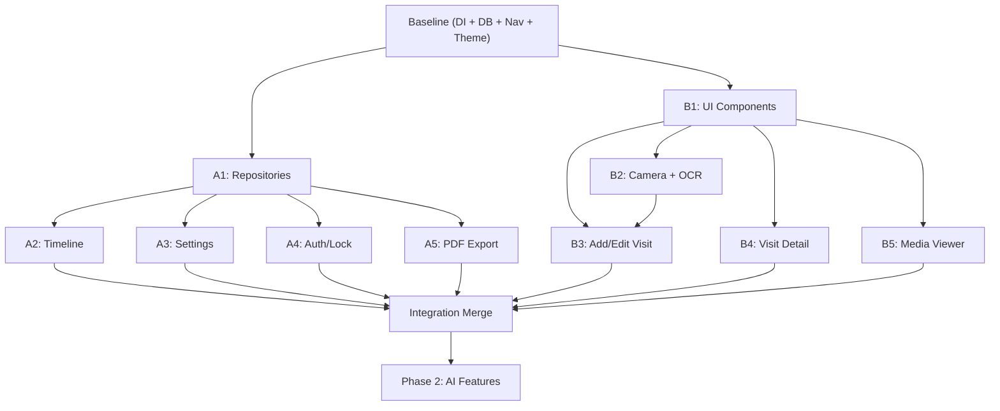

# MedVault — Implementation Plan

## Overview

**MedVault** — local-first, privacy-first personal health records manager for Android. Patients consolidate prescriptions, lab reports, X-rays across multiple doctors on their own phone. Zero cloud dependency (except opt-in AI in Phase 2).

---

## Tech Stack

| Layer | Technology | Notes |
|---|---|---|
| **Platform** | Android only | min SDK 26, target SDK 34 |
| **Language** | Kotlin (no Java) | 100% Kotlin codebase |
| **UI** | Jetpack Compose | Material 3, no XML layouts |
| **Architecture** | MVVM | ViewModel + StateFlow + Repository |
| **DI** | Hilt | `@HiltAndroidApp`, `@HiltViewModel`, `@Inject` |
| **Database** | Room (SQLite) | 5 tables + FTS4, TypeConverters, migrations |
| **File storage** | `context.filesDir` | Relative paths in DB, absolute at read time |
| **Serialization** | kotlinx.serialization | JSON columns in Room (medicines list, tags) |
| **Camera** | CameraX | Photo capture for prescriptions + attachments |
| **OCR** | ML Kit Text Recognition | On-device, no API key |
| **Search** | Room FTS4 | `@Fts4` virtual table, auto-synced |
| **Image loading** | Coil (coil-compose) | Async image loading in Compose |
| **PDF viewing** | AndroidPdfViewer | `com.github.barteksc:android-pdf-viewer` |
| **PDF export** | `PdfDocument` API | HTML → PDF on-device |
| **Auth** | `androidx.biometric` | Biometric + PIN fallback (bcrypt in EncryptedSharedPreferences) |
| **Build** | Gradle Kotlin DSL | `build.gradle.kts` |
| **AI** (Phase 2) | Retrofit + OkHttp | Gemini Flash / GPT-4o-mini, opt-in only |

---

## Phasing Strategy

### Phase 1 — Core App (Current)
Everything needed for a fully functional app **without** AI summaries:
- Project scaffold, DI, navigation, theme
- Room database (all tables, DAOs, TypeConverters, migrations)
- Repositories (Visit, Contact, Media)
- All 7 screens (Timeline, Add/Edit Visit, Visit Detail, Media Viewer, Export, Settings, Lock)
- CameraX + ML Kit OCR
- FTS4 search, sort, filter
- PDF export
- Biometric/PIN lock
- ZIP data export/import

### Phase 2 — AI Features (Later)
- `AiSummaryRepository` with Retrofit/OkHttp
- API key configuration in Settings (with privacy warning)
- AI summary card in Visit Detail
- "Generate AI Summary" button in Add/Edit Visit Step 2
- AI status display in Settings
- All integration points are marked `// TODO: PHASE 2 — AI` in Phase 1 code

---

## Low-Level Design

### Package Structure

```
com.medvault/
├── MedVaultApplication.kt                    # @HiltAndroidApp
├── MainActivity.kt                           # Single Activity, setContent { MedVaultApp() }
│
├── data/
│   ├── db/
│   │   ├── MedVaultDatabase.kt               # @Database, version = 1
│   │   ├── Converters.kt                     # TypeConverters (JSON ↔ List<Medicine>, List<String>)
│   │   └── migrations/
│   │       └── Migrations.kt                 # Migration infrastructure (empty for v1)
│   │
│   ├── entity/
│   │   ├── VisitEntity.kt
│   │   ├── PrescriptionEntity.kt
│   │   ├── AttachmentEntity.kt
│   │   ├── ContactEntity.kt
│   │   └── VisitFts.kt                       # @Fts4 virtual table
│   │
│   ├── dao/
│   │   ├── VisitDao.kt
│   │   ├── PrescriptionDao.kt
│   │   ├── AttachmentDao.kt
│   │   └── ContactDao.kt
│   │
│   ├── relation/
│   │   └── VisitWithDetails.kt               # @Embedded + @Relation
│   │
│   └── repository/
│       ├── VisitRepository.kt                # Coordinates VisitDao + PrescriptionDao + AttachmentDao
│       ├── ContactRepository.kt
│       ├── MediaRepository.kt                # File I/O in context.filesDir
│       └── AiSummaryRepository.kt            # STUB — Phase 2
│
├── domain/
│   └── model/
│       ├── Visit.kt                          # Domain model (clean, not Entity)
│       ├── Prescription.kt
│       ├── Medicine.kt                       # @Serializable
│       ├── AiSummary.kt                      # @Serializable — Phase 2
│       ├── Attachment.kt
│       └── Contact.kt
│
├── di/
│   ├── DatabaseModule.kt                     # @Module: provides MedVaultDatabase, all DAOs
│   ├── RepositoryModule.kt                   # @Module: binds repositories
│   └── AppModule.kt                          # @Module: app-level deps (Context, etc.)
│
├── ui/
│   ├── theme/
│   │   ├── Theme.kt                          # MedVaultTheme, color scheme, typography
│   │   ├── Color.kt                          # Teal palette, greys, surfaces
│   │   └── Type.kt                           # Typography scale
│   │
│   ├── navigation/
│   │   ├── MedVaultNavGraph.kt               # NavHost + all routes
│   │   ├── Screen.kt                         # Sealed class for route definitions
│   │   └── BottomNavBar.kt                   # Bottom navigation (Timeline, Settings)
│   │
│   ├── screens/
│   │   ├── timeline/
│   │   │   ├── TimelineScreen.kt             # Screen 1
│   │   │   ├── TimelineViewModel.kt
│   │   │   └── components/
│   │   │       ├── VisitCard.kt
│   │   │       ├── FilterSheet.kt
│   │   │       ├── SearchBar.kt
│   │   │       └── EmptyState.kt
│   │   │
│   │   ├── addvisit/
│   │   │   ├── AddEditVisitScreen.kt         # Screen 2 (4-step form)
│   │   │   ├── AddEditVisitViewModel.kt
│   │   │   └── components/
│   │   │       ├── StepIndicator.kt
│   │   │       ├── DoctorInfoStep.kt         # Step 1
│   │   │       ├── PrescriptionStep.kt       # Step 2
│   │   │       ├── AttachMediaStep.kt        # Step 3
│   │   │       ├── ReviewStep.kt             # Step 4
│   │   │       ├── MedicineForm.kt
│   │   │       ├── TagInput.kt
│   │   │       └── AutocompleteField.kt
│   │   │
│   │   ├── visitdetail/
│   │   │   ├── VisitDetailScreen.kt          # Screen 3
│   │   │   ├── VisitDetailViewModel.kt
│   │   │   └── components/
│   │   │       ├── MedicineCard.kt
│   │   │       └── MediaThumbnailRow.kt
│   │   │
│   │   ├── mediaviewer/
│   │   │   ├── MediaViewerScreen.kt          # Screen 4
│   │   │   └── MediaViewerViewModel.kt
│   │   │
│   │   ├── export/
│   │   │   ├── ExportScreen.kt               # Screen 5
│   │   │   └── ExportViewModel.kt
│   │   │
│   │   ├── settings/
│   │   │   ├── SettingsScreen.kt             # Screen 6
│   │   │   └── SettingsViewModel.kt
│   │   │
│   │   └── lock/
│   │       ├── LockScreen.kt                 # Screen 7
│   │       └── LockViewModel.kt
│   │
│   └── components/                           # Shared composables
│       ├── ConfirmDialog.kt
│       ├── LoadingIndicator.kt
│       └── SkeletonLoader.kt
│
├── camera/
│   └── CameraCapture.kt                      # CameraX composable wrapper
│
├── ocr/
│   └── OcrService.kt                         # ML Kit Text Recognition + medicine parser
│
└── auth/
    └── AuthManager.kt                        # Biometric + PIN + EncryptedSharedPreferences
```

### Data Flow Diagram



### Entity Relationship Diagram



### Navigation Graph



---

## Team Work Division

### Shared Baseline (Both devs together — Day 1-2)

Before splitting, both developers build the foundation **together** to avoid merge conflicts on core files:

| Task | Files |
|---|---|
| Android Studio project init | `build.gradle.kts` (project + app), `settings.gradle.kts` |
| Hilt setup | `MedVaultApplication.kt`, `MainActivity.kt` |
| All Room entities | `VisitEntity.kt`, `PrescriptionEntity.kt`, `AttachmentEntity.kt`, `ContactEntity.kt`, `VisitFts.kt` |
| Domain models | `Visit.kt`, `Medicine.kt`, `Prescription.kt`, `Attachment.kt`, `Contact.kt`, `AiSummary.kt` |
| TypeConverters | `Converters.kt` |
| `MedVaultDatabase.kt` | Database class with all DAOs |
| All DAOs | `VisitDao.kt`, `PrescriptionDao.kt`, `AttachmentDao.kt`, `ContactDao.kt` |
| `VisitWithDetails.kt` | Relation class |
| DI modules | `DatabaseModule.kt`, `RepositoryModule.kt`, `AppModule.kt` |
| Theme | `Theme.kt`, `Color.kt`, `Type.kt` |
| Navigation shell | `MedVaultNavGraph.kt`, `Screen.kt`, `BottomNavBar.kt` |
| Empty screen stubs | All 7 screen files with placeholder `Text("Screen Name")` |
| `AiSummaryRepository.kt` | Stub with `// TODO: PHASE 2 — AI` |

> [!IMPORTANT]
> The baseline must compile, run, and show the bottom nav with two tabs + empty screen placeholders. Both devs confirm this works on their machines before splitting.

---

### Dev A — Data & Core Screens

**Focus**: Repository layer, data-heavy screens, search/filter, settings, auth

#### Feature A1: Repositories (Day 3-4)
- `VisitRepository.kt` — full CRUD with `@Transaction` for save, cascade-aware delete
- `ContactRepository.kt` — upsert, autocomplete search query
- `MediaRepository.kt` — file I/O (copy to `context.filesDir`, delete, resolve paths)
- Unit tests for repository logic

#### Feature A2: Timeline Screen (Day 5-7)
- `TimelineScreen.kt` + `TimelineViewModel.kt`
- `VisitCard.kt` — date, doctor, hospital, diagnosis, media count
- Sort toggle (newest/oldest via `StateFlow`)
- `FilterSheet.kt` — bottom sheet with date range, doctor multi-select, tags, media type
- `SearchBar.kt` — real-time FTS4 search
- `EmptyState.kt` — illustration + prompt text
- FAB → navigate to AddEditVisit
- `SkeletonLoader.kt` for loading state

#### Feature A3: Settings Screen (Day 8-9)
- `SettingsScreen.kt` + `SettingsViewModel.kt`
- App lock section: biometric toggle, PIN setup, auto-lock timeout
- AI section: placeholder "Coming in a future update" with `// TODO: PHASE 2 — AI`
- Data section: Export ZIP, Import ZIP, Delete all data (type "DELETE")
- About section: version, licenses
- ZIP export: copies `medvault.db` + `context.filesDir/medvault/` into a ZIP, shares via `Intent`
- ZIP import: confirmation dialog → replaces DB and media files

#### Feature A4: Auth / Lock Screen (Day 10-11)
- `AuthManager.kt` — biometric check, PIN hash (bcrypt) in `EncryptedSharedPreferences`
- `LockScreen.kt` + `LockViewModel.kt`
- Auto-trigger biometric on app open
- PIN fallback keypad
- Auto-lock logic (immediately / 1 min / 5 min / never)
- Integration with `MainActivity.kt` lifecycle

#### Feature A5: PDF Export (Day 12-13)
- `ExportScreen.kt` + `ExportViewModel.kt`
- Checklist UI: medicines, prescription photo, each attachment (toggleable)
- AI summary checkbox (disabled with "Phase 2" label)
- HTML template generation → `PdfDocument` API
- Share via `Intent.ACTION_SEND` + "Save to Files"

---

### Dev B — UI Components & Camera/Media Flows

**Focus**: Add/Edit Visit form, camera/OCR, media viewer, visit detail, shared components

#### Feature B1: Shared UI Components (Day 3-4)
- `ConfirmDialog.kt` — reusable destructive action dialog
- `LoadingIndicator.kt` — `CircularProgressIndicator` with label
- `StepIndicator.kt` — 4-step progress bar
- `MedicineForm.kt` — repeatable medicine rows (name, dosage, frequency, duration, instructions) with "Add another" button
- `TagInput.kt` — free-text chip input with enter-to-add
- `AutocompleteField.kt` — text field with dropdown suggestions
- `MedicineCard.kt` — formatted medicine display (for Visit Detail)
- `MediaThumbnailRow.kt` — horizontal scrollable thumbnails

#### Feature B2: CameraX + OCR Service (Day 5-6)
- `CameraCapture.kt` — full-screen CameraX composable
- Capture → preview → "Retake" / "Use this"
- `OcrService.kt` — ML Kit Text Recognition wrapper
- `parseMedicinesFromText(rawText)` — best-effort regex parsing to extract medicine rows
- Loading indicator during OCR

#### Feature B3: Add/Edit Visit Screen (Day 7-10)
- `AddEditVisitScreen.kt` + `AddEditVisitViewModel.kt`
- Step 1 (`DoctorInfoStep.kt`): doctor name with autocomplete, phone, hospital, specialty, date picker, diagnosis, notes, next appointment, tags
- Step 2 (`PrescriptionStep.kt`): "Take photo" / "Type manually" buttons, photo → OCR → pre-fill medicines, medicine form with correction, AI summary button hidden with `// TODO: PHASE 2 — AI`
- Step 3 (`AttachMediaStep.kt`): grid of slots, action sheet (camera / gallery / PDF), type selector + caption, thumbnails with remove
- Step 4 (`ReviewStep.kt`): summary card, "Save visit" button
- On save: calls `VisitRepository.saveVisit()` in a `@Transaction`

#### Feature B4: Visit Detail Screen (Day 11-12)
- `VisitDetailScreen.kt` + `VisitDetailViewModel.kt`
- Loads via `VisitWithDetails`
- Header section: date, doctor, hospital, specialty, tappable phone
- Diagnosis & notes section
- AI summary placeholder: `// TODO: PHASE 2 — AI`
- Prescription medicines list (using `MedicineCard`)
- Prescription photo thumbnail (tappable → MediaViewer)
- Attached media horizontal row (using `MediaThumbnailRow`)
- Tags chip row
- Actions: Edit → AddEditVisit, Export → ExportScreen, Delete → ConfirmDialog

#### Feature B5: Media Viewer Screen (Day 13)
- `MediaViewerScreen.kt` + `MediaViewerViewModel.kt`
- Full-screen image viewer with pinch-to-zoom (Coil)
- Swipe left/right between attachments (HorizontalPager)
- PDF viewer integration (AndroidPdfViewer in AndroidView)
- Bottom bar: caption, type badge, date
- Top bar: close, share (system share sheet)

---

## Merge Strategy

```mermaid
gitgraph
    commit id: "Baseline" tag: "v0.1"
    branch dev-a
    branch dev-b
    
    checkout dev-a
    commit id: "A1: Repositories"
    commit id: "A2: Timeline"
    commit id: "A3: Settings"
    commit id: "A4: Auth/Lock"
    commit id: "A5: PDF Export"
    
    checkout dev-b
    commit id: "B1: UI Components"
    commit id: "B2: Camera+OCR"
    commit id: "B3: Add/Edit Visit"
    commit id: "B4: Visit Detail"
    commit id: "B5: Media Viewer"
    
    checkout main
    merge dev-a id: "Merge A"
    merge dev-b id: "Merge B" tag: "v1.0-phase1"
```

### Merge order and conflict avoidance

1. **Baseline** is committed to `main` by both devs together
2. Dev A branches `feature/data-and-core` from baseline
3. Dev B branches `feature/ui-and-media` from baseline
4. **Dev A merges first** — since repositories are the foundation, merging A first means B can resolve any interface changes
5. **Dev B merges second** — adjusts to any repository API changes from A
6. Both devs do a final integration pass together

### Interface contract (agreed at baseline)

Both devs code against these **agreed repository interfaces** so they can work independently:

```kotlin
// VisitRepository — Dev A implements, Dev B calls
interface VisitRepository {
    fun getAllVisits(): Flow<List<VisitWithDetails>>
    fun searchVisits(query: String): Flow<List<VisitEntity>>
    suspend fun getVisitById(id: String): VisitWithDetails?
    suspend fun saveVisit(
        visit: VisitEntity,
        prescription: PrescriptionEntity?,
        attachments: List<AttachmentEntity>
    )
    suspend fun deleteVisit(id: String)
}

// ContactRepository — Dev A implements, Dev B calls
interface ContactRepository {
    suspend fun searchDoctors(query: String): List<ContactEntity>
    suspend fun upsertContact(contact: ContactEntity)
}

// MediaRepository — Dev A implements, Dev B calls
interface MediaRepository {
    suspend fun saveImage(sourceUri: Uri, targetRelativePath: String): String
    suspend fun savePdf(sourceUri: Uri, targetRelativePath: String): String
    suspend fun deleteFile(relativePath: String)
    fun resolveAbsolutePath(relativePath: String): String
    suspend fun exportDataAsZip(): Uri
    suspend fun importDataFromZip(zipUri: Uri)
    suspend fun deleteAllData()
}
```

---

## Dependency Graph (Build Order)



---

## Timeline Summary

| Day | Dev A | Dev B |
|-----|-------|-------|
| 1-2 | **Baseline** (together) | **Baseline** (together) |
| 3-4 | A1: Repositories + tests | B1: Shared UI components |
| 5-7 | A2: Timeline screen | B2: CameraX + OCR (5-6), B3 start (7) |
| 8-9 | A3: Settings screen | B3: Add/Edit Visit (continued) |
| 10-11 | A4: Auth / Lock screen | B3: Add/Edit Visit (finish) |
| 12-13 | A5: PDF Export | B4: Visit Detail (11-12), B5: Media Viewer (13) |
| 14 | **Integration merge + bug fixing** (together) | **Integration merge + bug fixing** (together) |

---

## Phase 2 — AI Features (TODO)

> [!NOTE]
> All integration points below are marked with `// TODO: PHASE 2 — AI` in Phase 1 code.

| Task | File(s) | Description |
|---|---|---|
| AI Repository | `AiSummaryRepository.kt` | Retrofit + OkHttp, API key from EncryptedSharedPreferences |
| API key config | `SettingsScreen.kt` | Text field + privacy warning dialog |
| AI summary card | `VisitDetailScreen.kt` | Collapsible card with 3 sections, "Regenerate" button |
| Generate button | `PrescriptionStep.kt` | "Generate AI Summary" button, loading state |
| AI status | `SettingsScreen.kt` | Shows configured/not configured status |
| Retrofit module | `di/NetworkModule.kt` | New DI module for Retrofit, OkHttp |

---

## Open Questions

> [!NOTE]
> No blocking questions for Phase 1. Ready to build the baseline.

---

## Verification Plan

### Build Verification
- Project compiles with `./gradlew assembleDebug` at every feature merge
- No warnings treated as errors disabled

### Screen-Level Testing
- All 7 screens navigable end-to-end
- Add visit → appears in timeline → tap → detail → export → share
- Camera → OCR → medicine extraction → correction → save
- Search + filter on timeline
- Biometric/PIN lock + auto-lock
- ZIP export → import on different device → data intact

### Data Layer Testing
- Room instrumented tests for all DAOs
- Repository unit tests with in-memory Room database
- FTS4 search accuracy tests
- File I/O: save/delete/resolve paths
- CASCADE delete: visit deletion removes prescription + attachments + files
